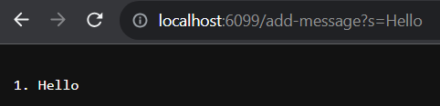

# Lab Report 2
---

## Part 1
Code for `StringServer`:
```
import java.io.IOException;
import java.net.URI;

class Handler implements URLHandler {
    // The one bit of state on the server: a number that will be manipulated by
    // various requests.
    int num = 0;
    String str = "";

    public String handleRequest(URI url) {
        if (url.getPath().equals("/")) {
            return "StringServer";
        } else if (url.getPath().equals("/add-message")) {
            String[] parameters = url.getQuery().split("=");
            if (parameters[0].equals("s")) {
                num++;
                str = String.format("%s \n %d. %s", str, num, parameters[1]);
                return str;
            } else {
                return "Unable to add string!";
            }
        } else {
            return "404 Not Found!";
        }
    }
}

class StringServer {
    public static void main(String[] args) throws IOException {
        if(args.length == 0){
            System.out.println("Missing port number! Try any number between 1024 to 49151");
            return;
        }

        int port = Integer.parseInt(args[0]);

        Server.start(port, new Handler());
    }
}
```
\
First time using `/add-message`:\
\
The `handleRequest` method was called, taking in the server's URI as its argument. The integer `num` and the string `str` are relevant fields that `handleRequest` uses. Before the method call, `num` is 0 and `str` is an empty string. After the `/add-message` request, `num` increases to 1 and `str` becomes the concatenation of the updated `num` and the given string to add.

Second time using `/add-message`:\
\
The `handleRequest` method was called again, with the URI as its argument. `num` and `str` are still the relevant fields, with `num` now being 1 and `str` being the previously concatenated string. After the second `/add-message` request, `num` increases again to 2 and `str` concatenates the previous string with the new `num` and the new given string.
