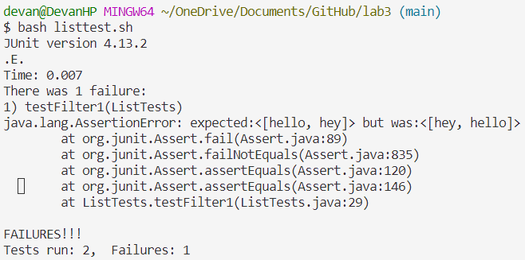

# Lab Report 3
---

## Part 1
I'm testing the `filter` method in `ListExamples`. The associated code for the tests is:
```
import static org.junit.Assert.*;
import org.junit.*;
import java.util.ArrayList;
import java.util.List;

interface StringChecker { boolean checkString(String s); }

class CheckForE implements StringChecker {
    public boolean checkString(String s) {
        if (s.contains("e")) {
            return true;
        } else {
            return false;
        }
    }
}
```
This includes the imports, interface, and class that implements the interface needed to test the `filter` method. The class I wrote returns `true` if the string contains the letter "e", and returns `false` if it doesn't.

A failure inducing input for the method is: 
```
    @Test
    public void testFilter1() {
        List<String> input = new ArrayList<>();
        StringChecker sc = new CheckForE();
        input.add("hi");
        input.add("hello");
        input.add("hey");
        List<String> expected = new ArrayList<>();
        expected.add("hello");
        expected.add("hey");
        assertEquals(expected, ListExamples.filter(input, sc));
    }
```

An input that does not induce an error is:
```
    @Test
    public void testFilter2() {
        List<String> input = new ArrayList<>();
        StringChecker sc = new CheckForE();
        input.add("hi");
        input.add("hello");
        List<String> expected = new ArrayList<>();
        expected.add("hello");
        assertEquals(expected, ListExamples.filter(input, sc));
    }
```

I'm using a bash script called `listtest.sh` to run the tests. The output of the tests being run is:
\
This output shows the symptom that the order in which we expect the strings to be in is the opposite of what they actually are in.

Before the bug is fixed:
```
  static List<String> filter(List<String> list, StringChecker sc) {
    List<String> result = new ArrayList<>();
    for(String s: list) {
      if(sc.checkString(s)) {
        result.add(0, s);
      }
    }
    return result;
  }
```

After the bug is fixed:
```
  static List<String> filter(List<String> list, StringChecker sc) {
    List<String> result = new ArrayList<>();
    for(String s: list) {
      if(sc.checkString(s)) {
        result.add(s);
      }
    }
    return result;
  }
```

The bug is in the line where the string is added to the result. In the original version, the string is added to index 0 of the list, but we want it to add the string to the end of the list, keeping the same order as the original list. We can fix this by removing the first input in the `add` method.

---
## Part 2
