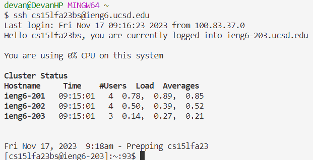
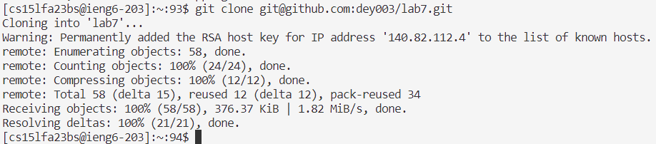
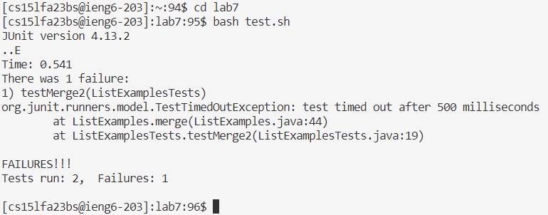
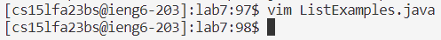
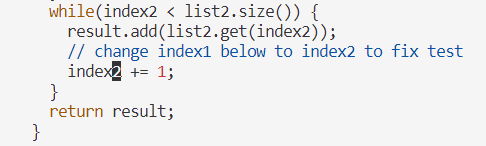
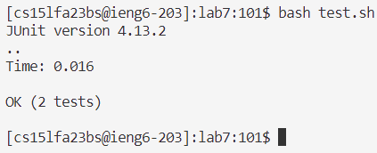
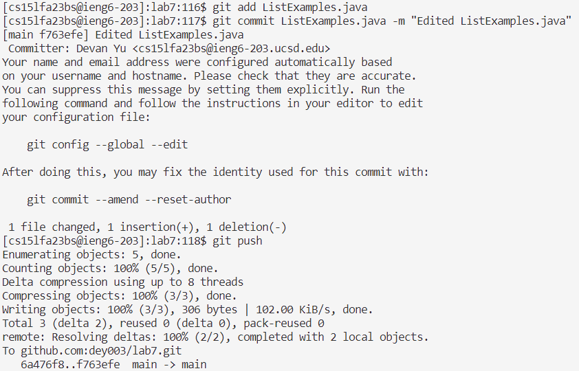

# Lab Report 4
---

### Step 4: Log into ieng6
\
*Key presses*: `ssh cs15lfa23bs@ieng6.ucsd.edu<enter>`

I ran the `ssh` command to log into the ieng6 remote server.

---
### Step 5: Clone your fork of the repository from your Github account (using the `SSH` URL)
\
*Key presses*: `git clone <ctrl+v><enter>` [^1]
[^1]: `<ctrl+v>` denotes holding `<ctrl>` and pressing `v` at the same time. From here on out, this will be the meaning of key presses written in the format `<special-character+key>`.

I copied the `SSH` URL to my clipboard, so I pasted it using `<ctrl+v>` into the `git clone` command.

---
### Step 6: Run the tests, demonstrating that they fail
\

---
### Step 7: Edit the code file to fix the failing test
\
\

---
### Step 8: Run the tests, demonstrating that they now succeed
\

---
### Step 9: Commit and push the resulting change to your Github account (you can pick any commit message!)
\
