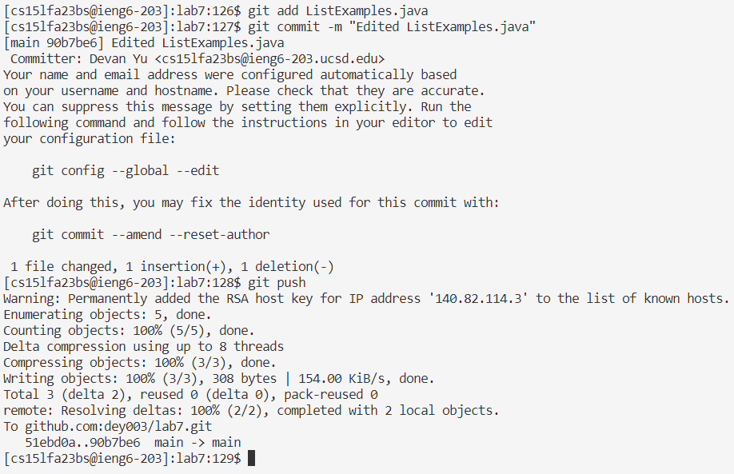

# Lab Report 4
---

### Step 4: Log into ieng6
\
*Key presses*: `ssh cs15lfa23bs@ieng6.ucsd.edu<enter>`

I ran the `ssh` command to log into the ieng6 remote server.

---
### Step 5: Clone your fork of the repository from your Github account (using the `SSH` URL)
\
*Key presses*: `git clone <ctrl+v><enter>` [^1]
[^1]: `<ctrl+v>` denotes holding `<ctrl>` and pressing `v` at the same time. From here on out, this will be the meaning of key presses written in the format `<special-character+key>`.

I copied the `lab7` repository's `SSH` URL to my clipboard, so I pasted it using `<ctrl+v>` into the `git clone` command.

---
### Step 6: Run the tests, demonstrating that they fail
\
*Key presses*: `cd lab7<enter>bash test.sh<enter>`

I used the `cd` command to enter the `lab7` directory and the `bash` command to run the tests.

---
### Step 7: Edit the code file to fix the failing test
 [^2]\
\
*Key presses*: `vim L<tab>.j<tab><enter>44<shift+g>er2:wq!<enter>`
[^2]: You may notice that the ieng6 command counter went from 95 in step 6 to 97 here. Here and going forward, skips in the command counter are a result of me running extra commands to verify that I'm doing the steps correctly and checking on the status of files. These commands aren't necessary to perform the procedure.

The first part of this step was done by `vim L<tab>.j<tab><enter>`. The first `<tab>` autocompletes `ListExamples`, since there are multiple files whose name starts with `ListExamples`. The second `<tab>` autocompletes `.java`, putting together the full file name `ListExamples.java`. I ran the `vim` command on this file to edit it directly in the terminal.\
The second part of this step was done by `44<shift+g>er2:wq!<enter>`. Here, I was editing the file using `vim`. Typing `44<shift+g>` jumps to the beginning of line 44, so in this case the cursor moved to the "i" in "index1". `e` jumps to the end of the current word, so the cursor moved to the "1" in "index1". `r` replaces the current character with the next typed character, so in this case the "1" was replaced with a "2". Finally, since `r` doesn't enter insert mode, I was still in normal mode, so `:wq!` saved changes and exited the file.

---
### Step 8: Run the tests, demonstrating that they now succeed
\
*Key presses*: `<up><up><enter>`

The `bash test.sh` command run in step 6 was 2 up in the search history, so I pressed `<up>` twice to reuse it.

---
### Step 9: Commit and push the resulting change to your Github account (you can pick any commit message!)
\
