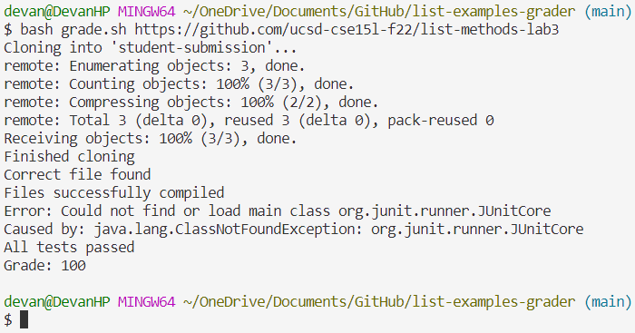
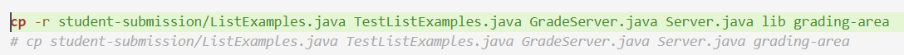

# Lab Report 5
---
## Part 1: Debugging Scenario

## Original Post
\
"Hello, I'm having trouble with a bug in my grading script. From the error message, I can tell it has something to do with my JUnit tests, but my JUnit files are clearly in the `lib` folder! I also made sure that the path I used works for Windows, which is what I'm using. Is something wrong with the extra test I wrote? Here is my code for `TestListExamples.java` and `grade.sh`:"\
**Code given here* (see code in "Information" section)\
"I would appreciate any help. Thanks!"

---
## TA Response
"From what I can tell, there is nothing wrong with your `TestListExamples.java` file. Try examining your `grade.sh` script closely, specifically the part where you enter the `grading-area` directory to give a grade. Think about what happens when you change directories, and how it changes things related to your JUnit files. Hope this helps!"

---
## Student Response
"Ohhh, I see! Since I moved into the `grading-area` directory, my `CPATH` no longer led to the `lib` folder. I fixed the bug by changing line 21 to also copy the `lib` directory into `grading-area`:"\
\
"Thanks so much for your help!"

---
## Information

### File Structure
The file structure is the same as that of the `list-examples-grader` GitHub repository we used in the Week 6 and Week 9 Lab, which can be seen [here](https://github.com/ucsd-cse15l-s23/list-examples-grader/tree/main).

### File Contents
`GradeServer.java` and `Server.java` are unchanged.

`TestListExamples.java` has been edited, adding another `StringChecker` and a test for the `filter` method:
```
import static org.junit.Assert.*;
import org.junit.*;

import java.util.ArrayList;
import java.util.Arrays;
import java.util.List;

class IsMoon implements StringChecker {
  public boolean checkString(String s) {
    return s.equalsIgnoreCase("moon");
  }
}

class CheckForE implements StringChecker {
  public boolean checkString(String s) {
    return s.contains("e");
  }
}

public class TestListExamples {
  @Test(timeout = 500)
  public void testMergeRightEnd() {
    List<String> left = Arrays.asList("a", "b", "c");
    List<String> right = Arrays.asList("a", "d");
    List<String> merged = ListExamples.merge(left, right);
    List<String> expected = Arrays.asList("a", "a", "b", "c", "d");
    assertEquals(expected, merged);
  }

  @Test
  public void testFilter1() {
    List<String> input = Arrays.asList("hi", "hello", "hey");
    StringChecker sc = new CheckForE();
    List<String> expected = Arrays.asList("hello", "hey");
    assertEquals(expected, ListExamples.filter(input, sc));
}
}
```

`grade.sh` has also been completed (with the exception of the bug), grading the given GitHub repository:
```
CPATH=".;lib/hamcrest-core-1.3.jar;lib/junit-4.13.2.jar"

# Change CPATH to work for Windows on local and Mac on remote

rm -rf student-submission
rm -rf grading-area

mkdir grading-area

git clone $1 student-submission
echo 'Finished cloning'

if [[ -f student-submission/ListExamples.java ]]
then
    echo "Correct file found"
else
    echo "Correct file not found"
    exit
fi

cp student-submission/ListExamples.java TestListExamples.java GradeServer.java Server.java grading-area

javac -cp $CPATH grading-area/*.java
if [[ $? -ne 0 ]]
then
    echo "Files did not compile"
    exit
else
    echo "Files successfully compiled"
fi

cd grading-area
java -cp $CPATH org.junit.runner.JUnitCore TestListExamples > test-results.txt
tests_total=`grep -oP "Tests run: \K\d+" test-results.txt`
tests_failed=`grep -oP "Failures: \K\d+" test-results.txt`
tests_passed="$((tests_total-tests_failed))"
if [[ ${#tests_total} -ne 0 ]]
then
    echo "$tests_passed tests passed out of $tests_total"
    grade=$((tests_passed/tests_total))
    echo "Grade: $grade"
else
    echo "All tests passed"
    echo "Grade: 100"
fi
```

### Bug-Triggering Command
The bug is triggered when running the Bash script on a sample GitHub repository using the command:\
`bash grade.sh https://github.com/ucsd-cse15l-f22/list-methods-lab3`

### How to Fix the Bug
We can see from the error output that the bug is related to running the JUnit tests. The bug occurs as a result of the need to move into the `grading-area` directory, as done in line 32 with the command:\
`cd grading-area`.\
Now, the `CPATH` relative path for the JUnit files is no longer valid because we are in a directory that does not contain the `lib` directory. To fix this, we can edit line 21 to be:\
`cp -r student-submission/ListExamples.java TestListExamples.java GradeServer.java Server.java lib grading-area`.\
We add the `lib` directory to be copied into `grading-area`, as well as the `-r` option for the `cp` command to recursively copy all files within `lib`. This makes `CPATH` a valid path to find the required JUnit files, fixing the bug.

---
## Part 2: Reflection
In lab for the second half of this quarter, I have learned how to use Vim to view and edit files directly from the command line, as well as using terminal commands to commit files to GitHub. Using these skills, I can do so many things just from the command line if I have to. I started this course having almost never used the terminal before, so it's cool to see how much we have covered in such a short time.
